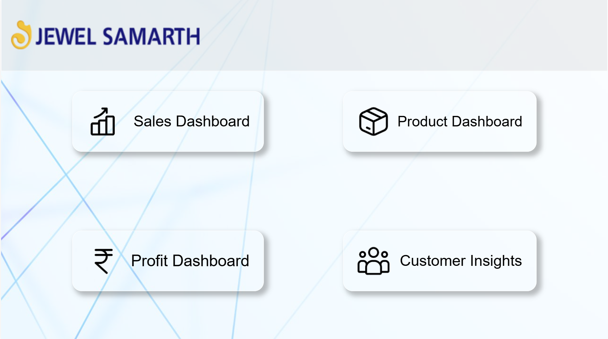
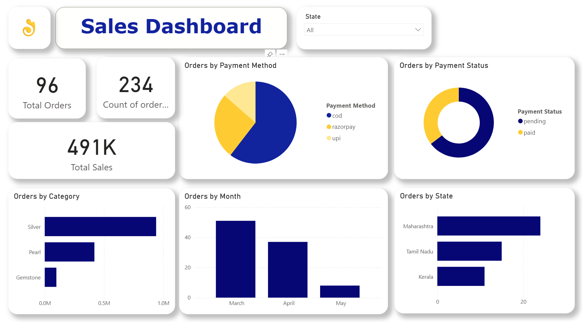
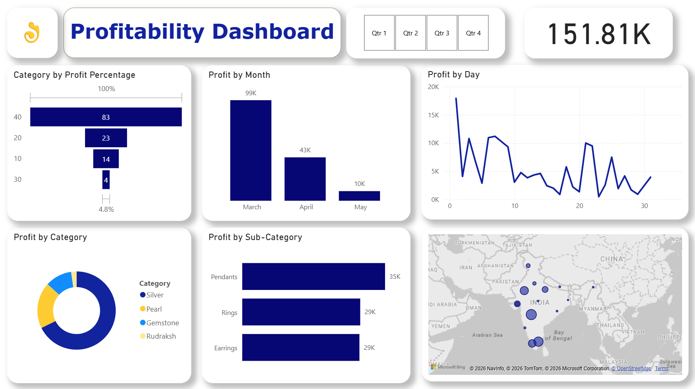

# 📊 Business Performance Dashboard


A Power BI dashboard developed to analyze business performance through interactive visualizations and key performance indicators (KPIs). The dashboard provides actionable insights into sales, profitability, and overall business performance to support data-driven decision-making.

---

## Project Overview

This project demonstrates the use of Microsoft Power BI to transform raw business data into meaningful insights. It enables stakeholders to monitor business performance, identify trends, evaluate profitability, and make informed strategic decisions through an intuitive and interactive dashboard.

---

## Project Objective

Develop an interactive Power BI dashboard to provide business stakeholders with a centralized view of sales performance, profitability, and key business metrics for data-driven decision-making.

---

## Key Features

- Interactive dashboards with drill-down capabilities
- KPI tracking and business performance monitoring
- Sales trend and profitability analysis
- Dynamic filtering using slicers
- Executive summary dashboard
- Interactive data exploration

---

## Dashboard Pages

### Dashboard Homepage
Provides a high-level overview of key business metrics, including sales, profit, revenue trends, and business KPIs.

### Sales Dashboard
Analyzes sales performance across products, categories, regions, and time periods to identify growth opportunities.

### Profitability Dashboard
Evaluates profit margins, high-performing products, and business segments to support profitability analysis.

---

## Dataset

The dashboard is built using a sample business dataset containing sales transactions, product information, customer details, regional performance, and profitability metrics.

---

## Tools & Technologies

- Microsoft Power BI
- Power Query
- DAX (Data Analysis Expressions)
- Data Modeling
- Interactive Data Visualization

---

## Skills Demonstrated

- Microsoft Power BI
- DAX
- Power Query
- Data Modeling
- Dashboard Development
- KPI Reporting
- Business Intelligence
- Data Visualization
- Business Analytics
  
---

## Key Insights

This dashboard enables organizations to:

- Monitor key business KPIs
- Track sales and profitability
- Identify performance trends
- Support strategic business decisions
- Improve operational efficiency

---

## Repository Contents

```
Business-Dashboard/
│
├── Business-Dashboard.pbix
├── README.md
├── dashboard-homepage.jpg
├── sales-dashboard.jpg
└── profitability-dashboard.jpg
```

## Dashboard Preview

### Dashboard Homepage



### Sales Dashboard



### Profitability Dashboard



---

## Author

**Vishwajit Waghdhare**

Data Business Analyst | Power BI | SQL | Business Intelligence | Data Analytics
