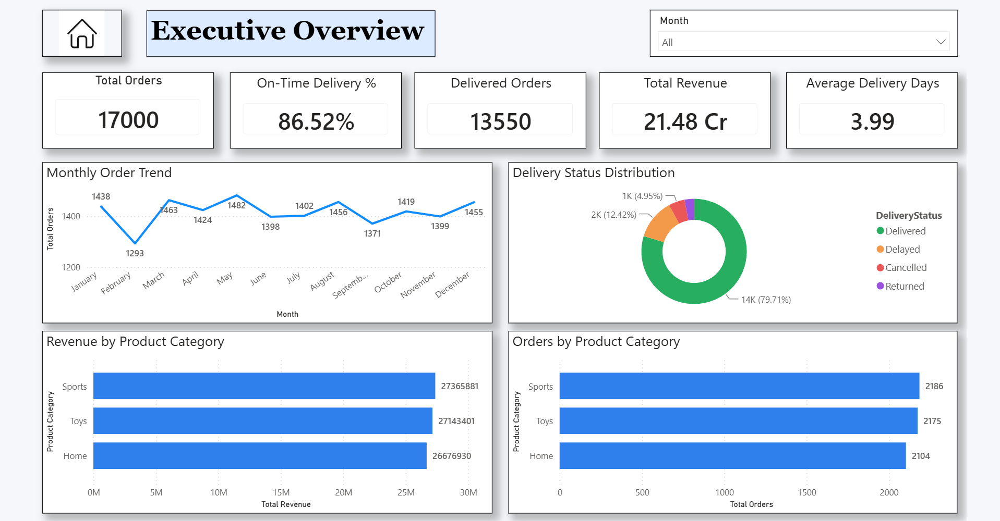
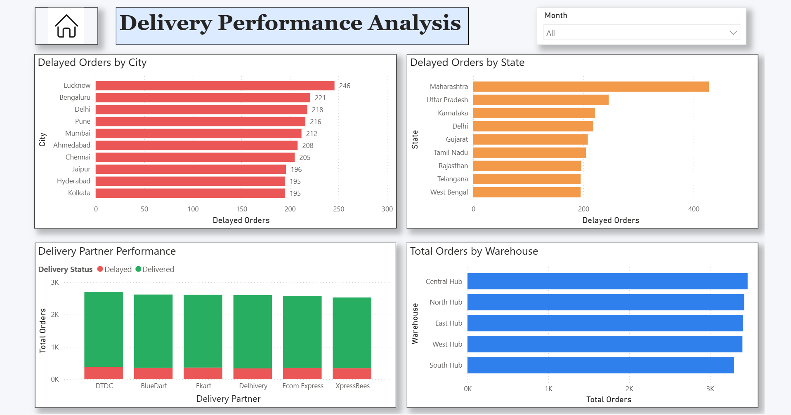
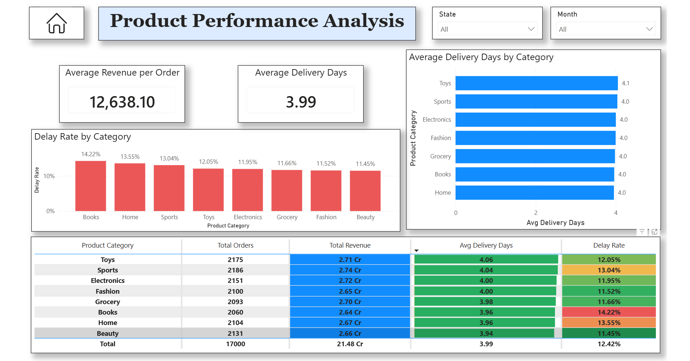

# 📦 E-Commerce Order Delivery Performance Dashboard


An interactive Power BI dashboard developed to monitor and analyze the end-to-end order delivery process of an e-commerce business. The dashboard provides comprehensive insights into delivery performance, order trends, product performance, customer purchasing behavior, payment methods, and logistics efficiency through dynamic visualizations and key performance indicators (KPIs).

---

## Project Overview

This project demonstrates the use of Microsoft Power BI to transform raw e-commerce order data into meaningful business insights. The dashboard enables business managers, operations teams, and logistics stakeholders to monitor delivery performance, identify delays, analyze customer purchasing patterns, evaluate product category performance, and optimize operational efficiency through interactive reports and visual analytics.

---

## Project Objective

Develop an interactive Power BI dashboard that provides business stakeholders with a centralized view of order delivery performance, logistics operations, product performance, and customer purchasing trends to improve operational efficiency and support data-driven decision-making.

---

## Key Features

- Interactive dashboard navigation
- Executive overview of delivery KPIs
- Delivery performance analysis
- Product category performance monitoring
- Customer & payment analysis
- Dynamic filtering using Month and State slicers
- KPI tracking for operational monitoring
- Monthly order trend analysis
- Delivery status distribution analysis
- Warehouse performance monitoring
- Delivery partner performance comparison
- Interactive cross-filtering across visuals

---

## Dashboard Pages

### Executive Overview

Provides a high-level summary of overall e-commerce delivery performance using key business KPIs such as Total Orders, Delivered Orders, Total Revenue, On-Time Delivery Percentage, and Average Delivery Days. It also highlights monthly order trends, delivery status distribution, and category-wise revenue and order performance.

### Delivery Performance Analysis

Analyzes logistics operations across cities, states, warehouses, and delivery partners. This page helps identify regions with higher delivery delays, evaluate courier performance, and monitor warehouse order distribution to improve operational efficiency.

### Product Performance Analysis

Provides detailed insights into product category performance by comparing revenue, total orders, average delivery days, and delay rates across different product categories. A detailed matrix enables quick comparison of category-level performance metrics.

### Customer & Payment Analysis

Analyzes customer purchasing behavior through monthly order growth, payment method distribution, and average order value by city. This page helps understand customer preferences, revenue contribution, and payment trends for better business planning.

---

## Dataset

The dashboard is built using an e-commerce order delivery dataset containing customer information, product details, order records, payment methods, delivery status, warehouse information, logistics partner details, city and state information, revenue metrics, and delivery timelines. The dataset supports comprehensive supply chain and business performance analysis across multiple operational dimensions.

---

## Tools & Technologies

- Microsoft Power BI
- Power Query
- DAX (Data Analysis Expressions)
- Data Modeling
- Interactive Data Visualization

---

## Skills Demonstrated

- Microsoft Power BI
- DAX
- Power Query
- Data Modeling
- Dashboard Development
- KPI Reporting
- Business Intelligence
- Supply Chain Analytics
- Retail Analytics
- Customer Analytics
- Logistics Performance Analysis
- Data Visualization
- Business Analytics
- Data Analytics

---

## Key Insights

This dashboard enables organizations to:

- Monitor overall order delivery performance.
- Track monthly order growth and seasonal demand.
- Evaluate on-time delivery performance.
- Identify cities and states with higher delivery delays.
- Compare delivery partner efficiency.
- Monitor warehouse order distribution.
- Analyze product category revenue and order contribution.
- Evaluate average delivery time across product categories.
- Understand customer payment preferences.
- Monitor average order value by city.
- Improve logistics planning and operational efficiency.
- Support data-driven supply chain decision-making.

---

## Repository Contents

```text
E-Commerce-Order-Delivery-Performance-Dashboard/
│
├── E-Commerce-Order-Delivery-Performance-Dashboard.pbix
├── README.md
├── Executive-Overview.png
├── Delivery-Performance-Analysis.png
├── Product-Performance-Analysis.png
└── Customer-Payment-Analysis.png
```

---

## Dashboard Preview

### Executive Overview



---

### Delivery Performance Analysis



---

### Product Performance Analysis



---

### Customer & Payment Analysis


---

## Business Value

This dashboard helps e-commerce businesses gain complete visibility into their order fulfillment and delivery operations by consolidating logistics, sales, product, and customer data into an interactive reporting solution. It enables decision-makers to monitor delivery performance, reduce operational bottlenecks, improve customer satisfaction, optimize warehouse and courier operations, and enhance overall supply chain efficiency through data-driven insights.

---

## Future Enhancements

- Real-time order tracking integration
- Predictive delivery delay forecasting
- Customer churn and repeat purchase analysis
- Delivery SLA monitoring
- Role-Level Security (RLS)
- Automated data refresh
- Mobile-optimized dashboard
- API integration with logistics platforms
- AI-powered demand forecasting
- Advanced operational alerts

---

## Author

**Vishwajit Waghdhare**

**Data Business Analyst | Power BI | SQL | Business Intelligence | Data Analytics**
