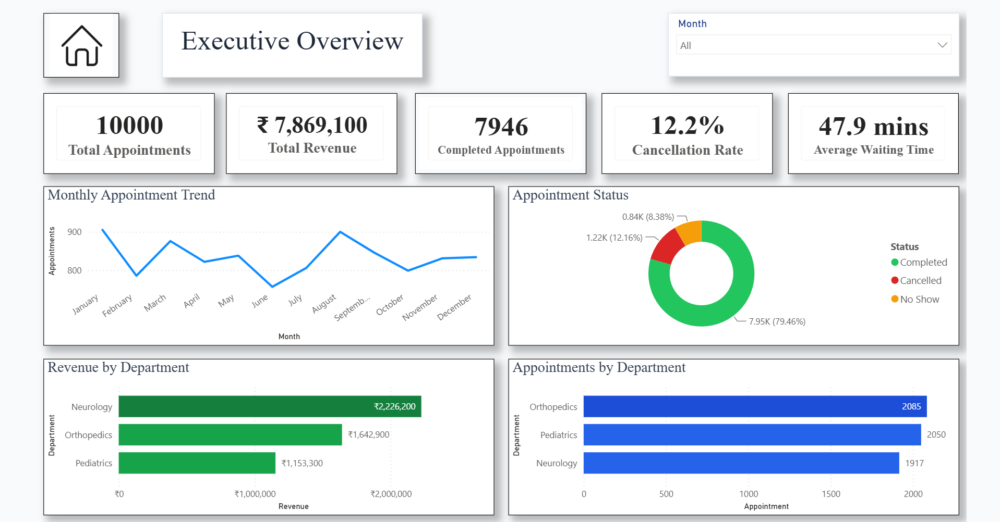
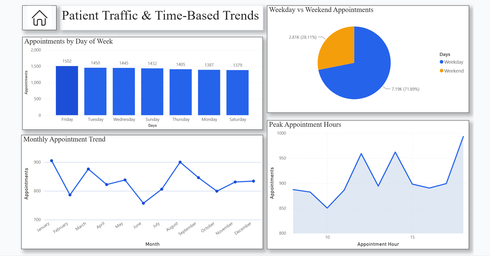
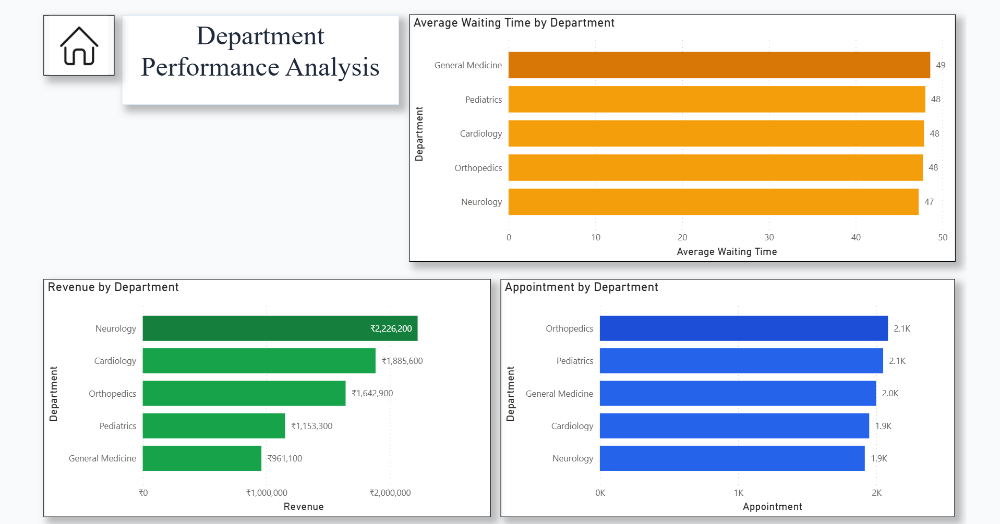

# 🏥 Hospital Patient Appointment Monitoring Dashboard


A Power BI dashboard developed to analyze hospital appointment operations through interactive visualizations and key performance indicators (KPIs). The dashboard provides actionable insights into patient appointments, department performance, appointment status, and operational efficiency to support data-driven healthcare decision-making.

---

## Project Overview

This project demonstrates the use of Microsoft Power BI to transform raw hospital appointment data into meaningful business insights. It enables hospital administrators and healthcare managers to monitor appointment performance, identify operational bottlenecks, analyze patient trends, and improve resource planning through an interactive and user-friendly dashboard.

---

## Project Objective

Develop an interactive Power BI dashboard that provides healthcare stakeholders with a centralized view of appointment performance, patient activity, department workload, and operational KPIs to support efficient hospital management and data-driven decision-making.

---

## Business Problem

Hospitals manage thousands of appointments across multiple departments every month. Without centralized reporting, it becomes difficult to:

- Monitor appointment volumes
- Track completed, cancelled, and no-show appointments
- Identify overloaded departments
- Analyze patient appointment trends
- Improve scheduling efficiency
- Support operational planning with real-time insights

This dashboard addresses these challenges by providing a comprehensive analytical view of hospital appointment data.

---

## Key Features

- Interactive dashboards with drill-down capabilities
- Executive summary with key hospital KPIs
- Appointment trend analysis
- Department-wise performance monitoring
- Patient appointment insights
- Dynamic filtering using slicers
- Interactive data exploration
- KPI tracking for operational performance

---

## Dashboard Pages

### Executive Dashboard

Provides a high-level overview of hospital appointment performance through key metrics, appointment status, patient volume, and overall operational KPIs.

---

### Appointment Analysis Dashboard

Analyzes appointment trends across different time periods to identify booking patterns, appointment distribution, and scheduling performance.

---

### Department Performance Dashboard

Evaluates appointment performance across hospital departments to identify workload distribution, department efficiency, and operational bottlenecks.

---

### Patient Insights Dashboard

Provides analytical insights into patient appointments, attendance patterns, appointment behavior, and overall patient activity.

---

## Dataset

The dashboard is built using a hospital appointment dataset containing patient information, appointment details, departments, appointment status, scheduling dates, and operational records used for healthcare performance analysis.

---

## Key Performance Indicators (KPIs)

- Total Appointments
- Total Patients
- Completed Appointments
- Cancelled Appointments
- No-Show Appointments
- Appointment Completion Rate
- Cancellation Rate
- Department-wise Appointments
- Monthly Appointment Trend
- Patient Distribution

---

## Tools & Technologies

- Microsoft Power BI
- Power Query
- DAX (Data Analysis Expressions)
- Data Modeling
- Interactive Data Visualization

---

## Skills Demonstrated

- Microsoft Power BI
- DAX
- Power Query
- Data Modeling
- Dashboard Development
- KPI Reporting
- Healthcare Analytics
- Business Intelligence
- Data Visualization
- Business Analytics
- Data Storytelling
- Interactive Dashboard Design

---

## Key Insights

This dashboard enables healthcare organizations to:

- Monitor hospital appointment KPIs
- Track appointment completion and cancellation rates
- Identify high-demand departments
- Analyze patient appointment trends
- Improve appointment scheduling efficiency
- Optimize resource allocation
- Support data-driven healthcare decisions
- Enhance overall patient experience

---

## Repository Contents

```
Hospital-Patient-Appointment-Monitoring-Dashboard/
│
├── Hospital-Patient-Appointment-Monitoring-Dashboard.pbix
├── README.md
├── executive-dashboard.png
├── appointment-analysis.png
├── department-performance.png
└── patient-insights.png
```

---

## Dashboard Preview

### Executive Overview


---

### Doctor Performance Analysis



---

### Department Performance Analysis



---

## Business Value

The dashboard helps healthcare organizations improve operational visibility by consolidating appointment data into a centralized reporting solution. It enables hospital administrators to identify scheduling inefficiencies, monitor department performance, optimize resource utilization, and make informed decisions that enhance both operational efficiency and patient satisfaction.

---

## Future Enhancements

- Real-time appointment monitoring
- Doctor-wise performance analysis
- Patient wait time analysis
- Predictive appointment forecasting
- Mobile-responsive dashboard
- Integration with Hospital Management Systems (HMS)

---

## Author

**Vishwajit Waghdhare**

**Data Business Analyst | Power BI | SQL | Business Intelligence | Data Analytics**

---

⭐ **If you found this project helpful, consider giving it a Star!**
